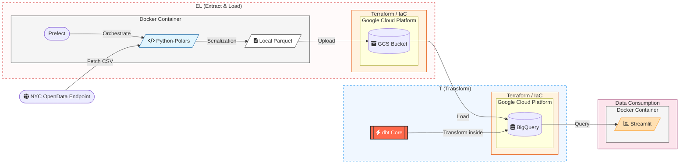
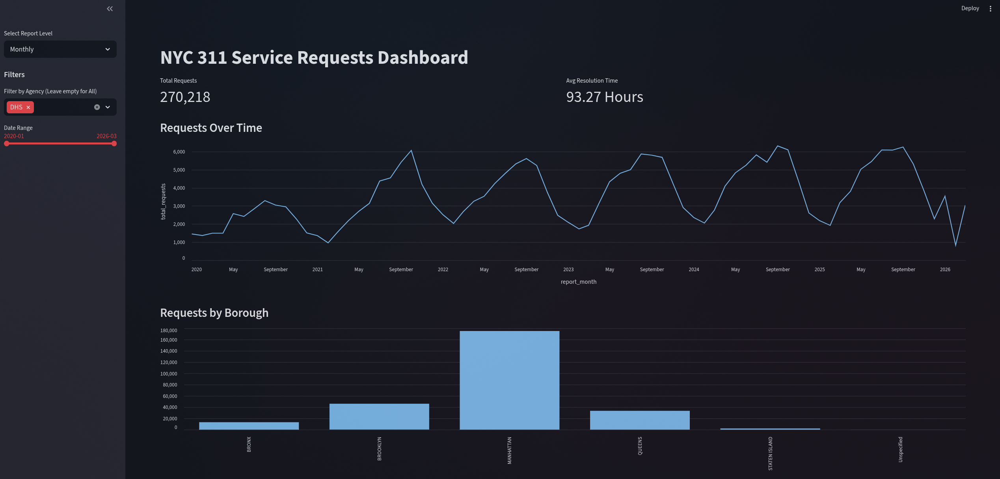

# NYC 311 Service Requests Analytics

## Problem Statement
NYC 311 data is massive and requires structured processing to identify trends in response times and complaint categories. This project builds an automated pipeline to extract raw data from API, convert it to optimized formats, and visualize agency performance across boroughs.

## Tech Stack
- Ingestion: Python script
- Data Processing: Polars
- Orchestration: Prefect
- Infrastructure as Code: Terraform
- Cloud: Google Cloud Platform (GCS, BigQuery)
- Transformations: dbt
- Containerization: Docker
- Visualization: Streamlit

## Data flow Diagram


## Prerequisites
- GCP Account and Project
- Service Account with BigQuery Admin and Storage Admin roles
- Docker and Docker Compose

## Setup

### 1. Infrastructure
1. Navigate to terraform directory: `cd terraform`
2. Create `terraform.tfvars` from the example and add your Project ID and Region.
3. Run:
   ```bash
   terraform init
   terraform apply
   ```

### 2. Configuration
1. Place your GCP service account JSON key at `creds_json/gcp_key.json`.
2. Create a `.env` file in the root directory based on `.env.example`.
3. Provide same values for `.env` as you provided for `terraform.tfvars`.

### 3. Execution
Start the services:
```bash
docker compose up -d
```

## Data Pipeline

### Prefect Deployments
The project includes three deployments to handle different data scales. Each supports the following parameters:
- `overwrite`: Boolean. If true, downloads data even if it exists and overwrites files in the GCS bucket.
- `erase_local_files`: Boolean. If true, removes the raw CSV files after they are converted to Parquet. 

Note: Parquet files are generated locally using Polars for optimizing storage and for schema enforcement before being uploaded to GCS.

### Transformations
dbt models are located in `dbt_transform/`. Run them via the worker container:
```bash
docker compose run --rm worker sh -c "cd dbt_transform && dbt seed && dbt run && dbt test"
```
The models follow a structured path:
- Staging: `stg_ny_311` (initial cleaning)
- Intermediate: `int_ny_311` (joins with agency metadata)
- Reporting: `rpt_ny_311_monthly_performance` and `rpt_ny_311_annual_performance`

To check docs run:
```
docker compose run --rm -p 8080:8080 worker sh -c "cd dbt_transform && dbt docs generate && dbt docs serve --port 8080"
```

### Dashboard
Access the Streamlit dashboard at `http://localhost:8501`. It uses Polars to process data fetched from BigQuery and includes a slider to filter by specific months.


## Project Structure
- `creds_json/`: GCP credentials.
- `terraform/`: GCP resource definitions.
- `data/` Mapped volume for extracted data from API.
- `extract/web_to_gcs.py`: Logic for API extraction and GCS upload.
- `main.py`: Entry point for the pipeline, Prefect flow definitions.
- `dbt_transform/`: dbt project (models, seeds, profiles).
- `dashboard/app.py`: Streamlit application.
